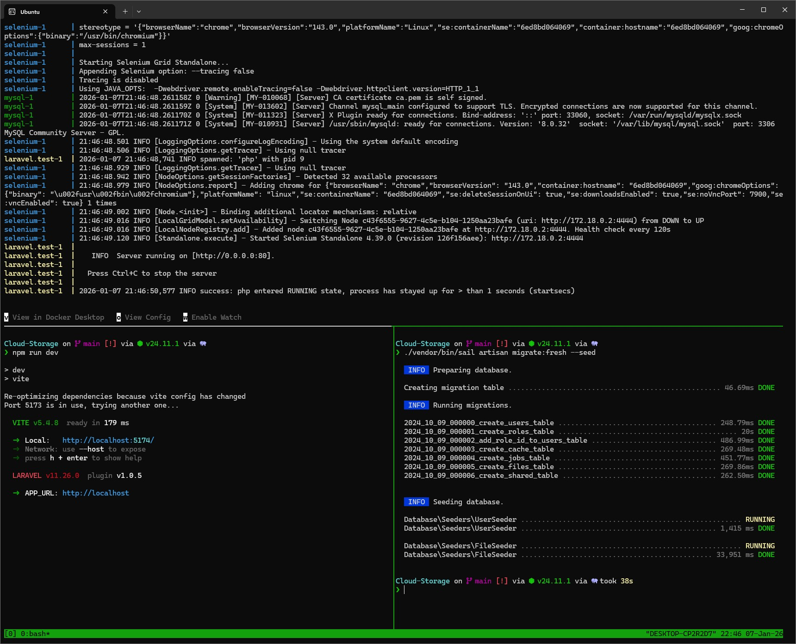
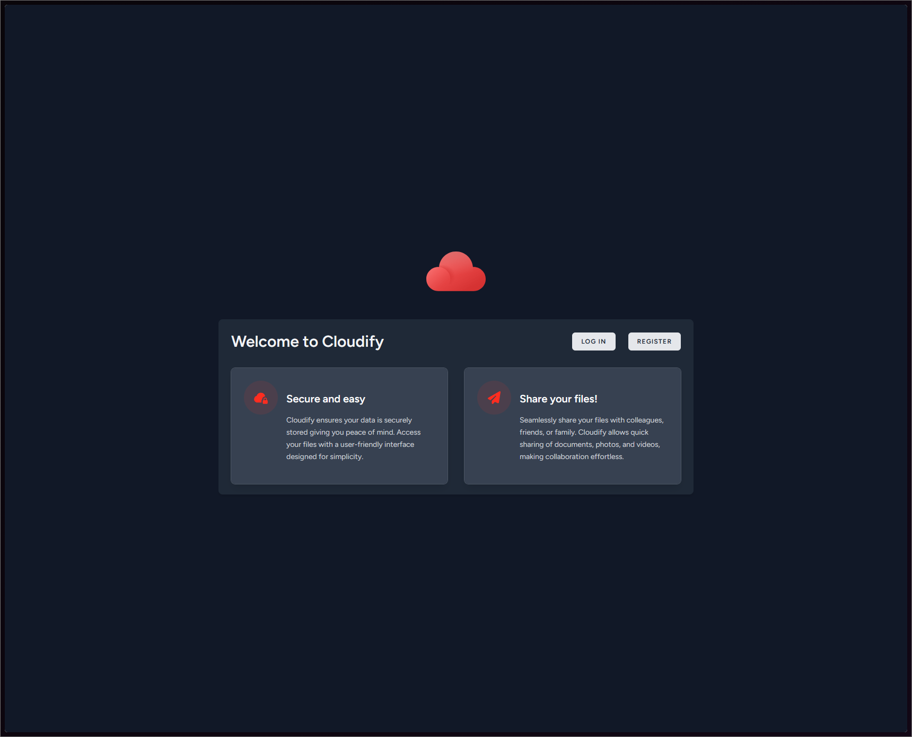

# How to Start This Project on Your Local Machine

1. Clone the files to your machine.

2. Run the following commands in the root of the project's directory
   (the command below creates a docker container which has composer and will be removed after use)

    ```bash
    docker run --rm -v $(pwd):/var/www/html -w /var/www/html composer:2.7 install
    ```

3. Make a .env file using the contents of .env.example.

4. (This command will start sail)

    ```bash
    ./vendor/bin/sail up
    ```

    or for detached mode

    ```bash
    ./vendor/bin/sail up -d
    ```

5. (Generates a key for encryption):

    ```bash
    ./vendor/bin/sail artisan key:generate
    ```

6. (Installed dependecys):

    ```bash
    ./vendor/bin/sail npm install
    ```

7. (Starts vite among other things):

    ```bash
    ./vendor/bin/sail npm run dev
    ```

8. (Test data and users):

    ```bash
    ./vendor/bin/sail artisan migrate:fresh --seed
    ```

9. Test the application

    There are 2 test users you can login as

    ```txt
    admin@admin.com
    ```

    ```txt
    user@user.com
    ```

    Both have the password:

    ```txt
    zxcasdqwe
    ```

    The admin user has an extra "dashboard" page but the logic for it doesn't make any sense last I rememberd

    The files are randomly generated so they are of no value to be downloaded, but can be.

## Screenshots



